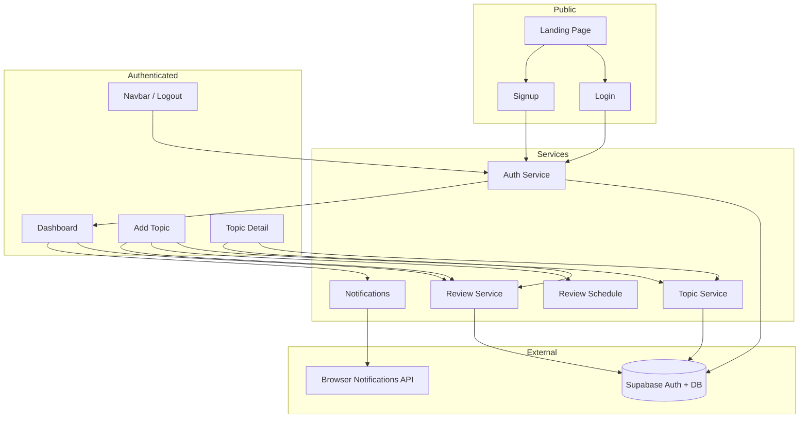

# RevAIson — Project Overview

RevAIson is a spaced-repetition reminder web app. Users capture what they studied, and the app automatically schedules reviews at **1 hour, 8 hours, 1 day, 1 week, and 1 month** after the study time. Browser notifications alert users when reviews are due.

**Stack:** Next.js 16 (App Router) · TypeScript · Tailwind CSS v4 · Supabase (Auth + PostgreSQL) · date-fns · Web Notifications API

---

## Table of Contents

1. [Functional Level Design (FLD)](#1-functional-level-design-fld)
2. [Low Level Design (LLD)](#2-low-level-design-lld)
3. [Core Logic & Flows](#3-core-logic--flows)
4. [Functions Reference](#4-functions-reference)
5. [Components, Types & Interfaces](#5-components-types--interfaces)
6. [Variables & Constants Reference](#6-variables--constants-reference)
7. [Directory Structure](#7-directory-structure)

---

## 1. Functional Level Design (FLD)

FLD describes **what the system does** from a user and feature perspective — modules, actors, and high-level behavior.

### 1.1 Actors

| Actor | Description |
| --- | --- |
| **Guest** | Can view the landing page; must sign up or log in to use the app |
| **Authenticated user** | Can create topics, view/manage reviews, receive notifications, and delete topics |

### 1.2 Functional Modules



### 1.3 Feature Breakdown

| Module | Features |
| --- | --- |
| **Authentication** | Email/password sign-up, sign-in, sign-out; session persistence via Supabase; redirect to dashboard if already logged in |
| **Topic management** | Create topic (title, optional notes, study datetime); view topic detail; delete topic (cascades reviews) |
| **Review scheduling** | Auto-generate 5 review intervals from `studied_at`; deduplicate by `(topic_id, interval_label)` |
| **Review queue** | Dashboard sections: Due now, Upcoming, Recently completed (last 50) |
| **Review completion** | Mark review complete from dashboard or topic detail; optimistic UI update on dashboard |
| **Notifications** | Request permission on dashboard load; show desktop notification for each due review (de-duplicated per session) |
| **Polling** | Dashboard refreshes review data every 60 seconds |

### 1.4 User Journeys

**Journey A — New user**

1. Visit `/` → click "Get started"
2. Sign up at `/signup` → (optional email confirm) → dashboard
3. Click "Add topic" → fill form → topic + 5 reviews created → redirect to dashboard
4. When a review is due → browser notification + appears in "Due now"
5. Click "Mark complete" → review moves to "Recently completed"

**Journey B — Returning user**

1. Visit `/login` → sign in → dashboard
2. View due/upcoming/completed reviews
3. Click topic title → topic detail with full schedule and notes
4. Mark individual reviews complete or delete entire topic

**Journey C — Session guard**

- Protected routes (`/dashboard`, `/add-topic`, `/topic/[id]`) call `getCurrentUser()`; unauthenticated users redirect to `/login`
- `/login` and `/signup` redirect to `/dashboard` if session exists

---

## 2. Low Level Design (LLD)

LLD describes **how the system is built** — architecture layers, data model, routing, and component relationships.

### 2.1 Architecture Layers

```
┌─────────────────────────────────────────────────────────┐
│  Presentation (app/* pages + components/*)              │
│  Client components ("use client") + React state/hooks   │
├─────────────────────────────────────────────────────────┤
│  Service Layer (lib/*Service.ts, reviewSchedule.ts)     │
│  Validation, Supabase queries, ServiceResult<T> pattern │
├─────────────────────────────────────────────────────────┤
│  Infrastructure (lib/supabaseClient.ts)                 │
│  Singleton Supabase client, env config                  │
├─────────────────────────────────────────────────────────┤
│  External: Supabase PostgreSQL + Auth (RLS enforced)    │
└─────────────────────────────────────────────────────────┘
```

There are **no Next.js API routes** — all data access runs client-side through the Supabase JS client with Row Level Security (RLS).

### 2.2 Database Schema

**Table: `topics`**

| Column | Type | Notes |
| --- | --- | --- |
| `id` | uuid (PK) | `gen_random_uuid()` |
| `user_id` | uuid | FK to auth.users |
| `title` | text | Required, max 200 chars (app-side) |
| `notes` | text | Optional, max 5000 chars (app-side) |
| `studied_at` | timestamptz | Base time for review schedule |
| `created_at` | timestamptz | Default `now()` |

**Table: `reviews`**

| Column | Type | Notes |
| --- | --- | --- |
| `id` | uuid (PK) | |
| `topic_id` | uuid (FK) | References `topics`, ON DELETE CASCADE |
| `user_id` | uuid | Owner |
| `interval_label` | text | One of: `1 hour`, `8 hours`, `1 day`, `1 week`, `1 month` |
| `review_time` | timestamptz | When review becomes due |
| `completed` | boolean | Default `false` |
| `completed_at` | timestamptz | Set on completion |
| `created_at` | timestamptz | |

**Indexes & constraints**

- Unique: `(topic_id, interval_label)` — prevents duplicate schedules
- Index: `(user_id, completed, review_time)` — dashboard queries

**RLS policies:** Users can only read/write rows where `auth.uid() = user_id`.

### 2.3 Routing Map

| Route | File | Auth | Purpose |
| --- | --- | --- | --- |
| `/` | `app/page.tsx` | Public | Landing page |
| `/login` | `app/login/page.tsx` | Public (redirect if authed) | Sign in |
| `/signup` | `app/signup/page.tsx` | Public (redirect if authed) | Register |
| `/dashboard` | `app/dashboard/page.tsx` | Required | Review queue |
| `/add-topic` | `app/add-topic/page.tsx` | Required | Create topic |
| `/topic/[id]` | `app/topic/[id]/page.tsx` | Required | Topic detail |

### 2.4 Component Hierarchy

```
RootLayout (app/layout.tsx)
├── LandingPage (app/page.tsx)
│   └── Feature (local)
├── LoginPage / SignupPage
│   └── AuthForm
├── DashboardPage
│   ├── Navbar
│   └── ReviewList (×3: due, upcoming, completed)
│       └── ReviewCard
├── AddTopicPage
│   ├── Navbar
│   └── TopicForm
└── TopicDetailPage
    └── Navbar
```

### 2.5 Service Result Pattern

All service functions return a discriminated union:

```typescript
type ServiceResult<T> =
  | { data: T; error: null }
  | { data: null; error: string };
```

Callers check `error` before using `data`. This keeps error handling consistent without throwing.

### 2.6 Supabase Client Singleton

`lib/supabaseClient.ts` creates one shared `SupabaseClient`:

- Reads `NEXT_PUBLIC_SUPABASE_URL` and `NEXT_PUBLIC_SUPABASE_ANON_KEY`
- Dev: stored on `globalThis.__revaisonSupabaseClient` to survive HMR
- Auth: `persistSession`, `autoRefreshToken`, `detectSessionInUrl`

---

## 3. Core Logic & Flows

### 3.1 Topic Creation Flow

```
User submits TopicForm
  → validate title + studiedAt locally
  → getCurrentUser() → userId
  → createTopic(userId, title, notes, studiedDate)
       → sanitize title (trim, max 200)
       → sanitize notes (trim, max 5000, null if empty)
       → INSERT into topics
  → generateReviewSchedule(studiedDate)
       → for each interval: addHours/addDays/addWeeks/addMonths
  → createReviews(userId, topicId, schedule)
       → skip intervals already in DB for this topic
       → INSERT batch into reviews
  → router.replace("/dashboard")
```

### 3.2 Review Schedule Generation

Fixed intervals from `studied_at`:

| Label | Offset |
| --- | --- |
| `1 hour` | +1 hour |
| `8 hours` | +8 hours |
| `1 day` | +1 day |
| `1 week` | +1 week |
| `1 month` | +1 month |

Implemented in `lib/reviewSchedule.ts` using `date-fns`. Pure function — no side effects.

### 3.3 Dashboard Review Classification

| Bucket | Query condition |
| --- | --- |
| **Due** | `completed = false` AND `review_time <= now` |
| **Upcoming** | `completed = false` AND `review_time > now` |
| **Completed** | `completed = true`, ordered by `completed_at` DESC, limit 50 |

All three queries join `topics(id, title)` for display.

### 3.4 Mark Review Complete (Optimistic)

Dashboard `handleComplete`:

1. Snapshot current state
2. Optimistically move review from `due` → `completed` in local state
3. Call `markReviewCompleted(userId, reviewId)` → sets `completed: true`, `completed_at: now`
4. On error: revert to snapshot and surface error

Topic detail page uses a simpler non-optimistic update (maps review in local array).

### 3.5 Notification Logic

1. On dashboard mount: `requestNotificationPermission()`
2. After each `loadReviews`: for each due review, call `showReviewNotification(review)`
3. `showReviewNotification` skips if: unsupported, permission not granted, or `review.id` already in `shownReviewIds` Set
4. Uses `Notification` API with tag `review-{id}` for browser-level dedup

### 3.6 Auth Validation

`authService.validateCredentials` (internal):

- Email required, must match regex
- Password required, minimum 8 characters

Applied to both `signUp` and `signIn`.

---

## 4. Functions Reference

This project uses **function components and plain functions** — there are no ES6 classes.

### 4.1 `lib/supabaseClient.ts`

| Name | Scope | Description |
| --- | --- | --- |
| `supabase` | exported const | Singleton Supabase client instance |

### 4.2 `lib/authService.ts`

| Function | Parameters | Returns | Description |
| --- | --- | --- | --- |
| `validateCredentials` | `email`, `password` | `string \| null` | Internal; returns error message or null |
| `signUp` | `email`, `password` | `ServiceResult<{user, session}>` | Register via Supabase Auth |
| `signIn` | `email`, `password` | `ServiceResult<{user, session}>` | Password sign-in |
| `signOut` | — | `ServiceResult<true>` | End session |
| `getCurrentUser` | — | `ServiceResult<User \| null>` | Get authenticated user; treats missing session as null |

### 4.3 `lib/topicService.ts`

| Function | Parameters | Returns | Description |
| --- | --- | --- | --- |
| `sanitize` | `value`, `max` | `string` | Internal; trim and truncate |
| `requireUserId` | `userId` | `string \| null` | Internal; returns error if missing |
| `createTopic` | `userId`, `title`, `notes`, `studiedAt` | `ServiceResult<Topic>` | Insert topic |
| `getTopics` | `userId` | `ServiceResult<Topic[]>` | List user's topics (newest first) |
| `getTopicById` | `userId`, `topicId` | `ServiceResult<Topic>` | Single topic with ownership check |
| `deleteTopic` | `userId`, `topicId` | `ServiceResult<true>` | Delete topic (reviews cascade) |

### 4.4 `lib/reviewService.ts`

| Function | Parameters | Returns | Description |
| --- | --- | --- | --- |
| `requireUserId` | `userId` | `string \| null` | Internal |
| `createReviews` | `userId`, `topicId`, `scheduleItems` | `ServiceResult<Review[]>` | Batch insert; dedupes intervals |
| `getDueReviews` | `userId` | `ServiceResult<ReviewWithTopic[]>` | Incomplete, past due |
| `getUpcomingReviews` | `userId` | `ServiceResult<ReviewWithTopic[]>` | Incomplete, future |
| `getCompletedReviews` | `userId` | `ServiceResult<ReviewWithTopic[]>` | Last 50 completed |
| `getReviewsForTopic` | `userId`, `topicId` | `ServiceResult<Review[]>` | All reviews for one topic |
| `markReviewCompleted` | `userId`, `reviewId` | `ServiceResult<Review>` | Set completed + timestamp |

### 4.5 `lib/reviewSchedule.ts`

| Function / Export | Parameters | Returns | Description |
| --- | --- | --- | --- |
| `generateReviewSchedule` | `studiedAt: Date` | `ReviewScheduleItem[]` | Build 5-interval schedule |
| `REVIEW_INTERVAL_LABELS` | — | `ReadonlyArray<IntervalLabel>` | Ordered list of interval names |

### 4.6 `lib/notifications.ts`

| Function | Parameters | Returns | Description |
| --- | --- | --- | --- |
| `isNotificationSupported` | — | `boolean` | Checks `window.Notification` |
| `requestNotificationPermission` | — | `Promise<NotificationPermission>` | Prompt or return current status |
| `showReviewNotification` | `review: ReviewWithTopic` | `void` | Fire desktop notification (once per id) |
| `resetNotificationCache` | — | `void` | Clear `shownReviewIds` Set |

### 4.7 Page & Component Handlers

| Location | Function | Description |
| --- | --- | --- |
| `app/login/page.tsx` | `handleLogin` | Calls `signIn`, redirects to dashboard |
| `app/signup/page.tsx` | `handleSignup` | Calls `signUp`; handles email-confirm flow |
| `app/dashboard/page.tsx` | `loadReviews` | Parallel fetch due/upcoming/completed + notify |
| `app/dashboard/page.tsx` | `handleComplete` | Optimistic mark complete |
| `app/topic/[id]/page.tsx` | `handleMarkComplete` | Mark single review on detail page |
| `app/topic/[id]/page.tsx` | `handleDelete` | Confirm + delete topic |
| `components/Navbar.tsx` | `handleLogout` | Sign out + redirect |
| `components/AuthForm.tsx` | `handleSubmit` | Form submit wrapper |
| `components/TopicForm.tsx` | `handleSubmit` | Full create-topic pipeline |
| `components/TopicForm.tsx` | `defaultStudiedAtValue` | Returns current datetime for input default |
| `components/ReviewCard.tsx` | `handleComplete` | Delegates to `onComplete` prop |
| `app/page.tsx` | `Feature` | Local presentational sub-component |

---

## 5. Components, Types & Interfaces

### 5.1 React Components (default exports)

| Component | File | Props | Role |
| --- | --- | --- | --- |
| `RootLayout` | `app/layout.tsx` | `{ children }` | HTML shell, fonts, metadata |
| `LandingPage` | `app/page.tsx` | — | Marketing landing |
| `LoginPage` | `app/login/page.tsx` | — | Login route |
| `SignupPage` | `app/signup/page.tsx` | — | Signup route |
| `DashboardPage` | `app/dashboard/page.tsx` | — | Main review queue |
| `AddTopicPage` | `app/add-topic/page.tsx` | — | Topic creation page |
| `TopicDetailPage` | `app/topic/[id]/page.tsx` | `{ params: Promise<{id}> }` | Topic + schedule detail |
| `Navbar` | `components/Navbar.tsx` | — | App navigation + logout |
| `AuthForm` | `components/AuthForm.tsx` | `{ mode, onSubmit }` | Shared login/signup form |
| `TopicForm` | `components/TopicForm.tsx` | — | Create topic form |
| `ReviewCard` | `components/ReviewCard.tsx` | `{ review, onComplete?, variant? }` | Single review card |
| `ReviewList` | `components/ReviewList.tsx` | `{ title, reviews, emptyMessage, ... }` | Grid of ReviewCards |

### 5.2 TypeScript Types & Interfaces (`types/index.ts`)

| Name | Kind | Fields / Values |
| --- | --- | --- |
| `IntervalLabel` | union type | `"1 hour" \| "8 hours" \| "1 day" \| "1 week" \| "1 month"` |
| `Topic` | interface | `id`, `user_id`, `title`, `notes`, `studied_at`, `created_at` |
| `Review` | interface | `id`, `topic_id`, `user_id`, `interval_label`, `review_time`, `completed`, `completed_at`, `created_at` |
| `ReviewWithTopic` | interface | Extends `Review` + `topic: Pick<Topic, "id" \| "title"> \| null` |
| `ReviewScheduleItem` | interface | `interval_label`, `review_time: Date` |
| `ServiceResult<T>` | discriminated union | `{ data: T, error: null } \| { data: null, error: string }` |

### 5.3 Component Prop Interfaces

| Interface | File | Fields |
| --- | --- | --- |
| `AuthFormProps` | `components/AuthForm.tsx` | `mode: AuthMode`, `onSubmit` callback |
| `AuthMode` | `components/AuthForm.tsx` | `"login" \| "signup"` |
| `ReviewCardProps` | `components/ReviewCard.tsx` | `review`, `onComplete?`, `variant?` |
| `ReviewListProps` | `components/ReviewList.tsx` | `title`, `description?`, `reviews`, `emptyMessage`, `variant?`, `onComplete?` |
| `DashboardState` | `app/dashboard/page.tsx` | `due`, `upcoming`, `completed` arrays |
| `TopicDetailPageProps` | `app/topic/[id]/page.tsx` | `params: Promise<{ id: string }>` |

### 5.4 External Types Used

| Type | Source | Usage |
| --- | --- | --- |
| `User`, `Session` | `@supabase/supabase-js` | Auth return types |
| `SupabaseClient` | `@supabase/supabase-js` | Client typing |
| `Metadata` | `next` | Root layout SEO |
| `NotificationPermission` | DOM / Web API | Notification permission state |

---

## 6. Variables & Constants Reference

### 6.1 Environment Variables

| Variable | Required | Usage |
| --- | --- | --- |
| `NEXT_PUBLIC_SUPABASE_URL` | Yes | Supabase project URL |
| `NEXT_PUBLIC_SUPABASE_ANON_KEY` | Yes | Public anon key (RLS-protected) |
| `NODE_ENV` | Auto | Dev singleton guard for Supabase client |

### 6.2 Module-Level Constants

| Name | File | Value | Purpose |
| --- | --- | --- | --- |
| `TITLE_MAX_LENGTH` | `lib/topicService.ts` | `200` | Title sanitization limit |
| `NOTES_MAX_LENGTH` | `lib/topicService.ts` | `5000` | Notes sanitization limit |
| `EMAIL_REGEX` | `lib/authService.ts` | `/^[^\s@]+@[^\s@]+\.[^\s@]+$/` | Email validation |
| `MIN_PASSWORD_LENGTH` | `lib/authService.ts` | `8` | Password minimum |
| `INTERVAL_BUILDERS` | `lib/reviewSchedule.ts` | Array of `{label, build}` | Interval → date-fn mapping |
| `REVIEW_INTERVAL_LABELS` | `lib/reviewSchedule.ts` | Derived from builders | Exported label list |
| `REFRESH_INTERVAL_MS` | `app/dashboard/page.tsx` | `60_000` | Dashboard poll interval (60s) |
| `UUID_REGEX` | `app/topic/[id]/page.tsx` | UUID v4 pattern | Route param validation |
| `shownReviewIds` | `lib/notifications.ts` | `Set<string>` | Session notification dedup |

### 6.3 Supabase Client Variables

| Name | File | Description |
| --- | --- | --- |
| `supabaseUrl` | `lib/supabaseClient.ts` | From env |
| `supabaseAnonKey` | `lib/supabaseClient.ts` | From env |
| `globalThis.__revaisonSupabaseClient` | `lib/supabaseClient.ts` | Dev HMR cache |

### 6.4 React State Variables (by page/component)

**LoginPage:** `checking`

**SignupPage:** `checking`, `info`

**DashboardPage:** `userId`, `state` (DashboardState), `loading`, `refreshing`, `error`

**AddTopicPage:** `checking`

**TopicDetailPage:** `topic`, `reviews`, `loading`, `error`, `marking`, `deleting`

**Navbar:** `signingOut`

**AuthForm:** `email`, `password`, `error`, `loading`

**TopicForm:** `title`, `notes`, `studiedAt`, `submitting`, `error`

**ReviewCard:** `marking`, `error`

### 6.5 Local / Derived Variables (notable)

| Name | Location | Description |
| --- | --- | --- |
| `nowIso` | `reviewService.ts` | Current time as ISO string for queries |
| `existingLabels`, `seen` | `reviewService.ts` | Dedup sets during review creation |
| `cleanTitle`, `cleanNotes` | `topicService.ts` | Sanitized input |
| `schedule` | `TopicForm`, `reviewSchedule.ts` | Generated review times |
| `reviewDate`, `reviewIsPast` | `ReviewCard.tsx` | Parsed date + due check |
| `accent` | `ReviewCard.tsx` | CSS class by variant |
| `submitLabel` | `AuthForm.tsx` | Dynamic button text |
| `geistSans`, `geistMono` | `app/layout.tsx` | Font configuration |

---

## 7. Directory Structure

```
revaison/
├── app/
│   ├── layout.tsx              # Root layout, fonts, metadata
│   ├── page.tsx                # Landing page
│   ├── globals.css             # Tailwind + global styles
│   ├── login/page.tsx          # Login
│   ├── signup/page.tsx         # Signup
│   ├── dashboard/page.tsx      # Review dashboard (core app)
│   ├── add-topic/page.tsx      # Topic creation
│   └── topic/[id]/page.tsx     # Topic detail + schedule
├── components/
│   ├── Navbar.tsx              # Navigation bar
│   ├── AuthForm.tsx            # Login/signup form
│   ├── TopicForm.tsx           # Topic creation form
│   ├── ReviewCard.tsx          # Single review card
│   └── ReviewList.tsx          # Review section grid
├── lib/
│   ├── supabaseClient.ts       # Supabase singleton
│   ├── authService.ts          # Authentication
│   ├── topicService.ts         # Topic CRUD
│   ├── reviewService.ts        # Review queries + completion
│   ├── reviewSchedule.ts       # Pure schedule generator
│   └── notifications.ts        # Browser notifications
├── types/
│   └── index.ts                # Shared TypeScript types
├── public/                     # Static assets (icons, SVGs)
├── package.json
├── next.config.ts
├── tsconfig.json
├── postcss.config.mjs
├── eslint.config.mjs
├── README.md
└── project-overview.md         # This document
```

---

## Summary

| Aspect | Detail |
| --- | --- |
| **Purpose** | Spaced-repetition reminders for self-directed learning |
| **Pattern** | Client-side SPA-style pages with service layer + Supabase backend |
| **No classes** | Functional React components + async service functions |
| **Security** | Supabase RLS; anon key only; ownership enforced server-side |
| **Key algorithm** | Fixed 5-interval schedule from `studied_at` via date-fns |
| **Real-time feel** | 60s polling + browser notifications on dashboard |
