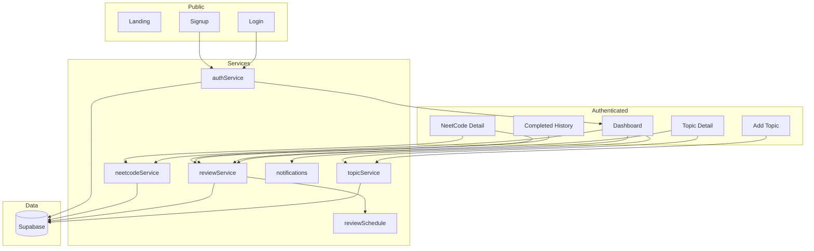

# RevAIson — Project Overview

RevAIson is an **adaptive study dashboard**. Users capture personal topics and track NeetCode 150 questions. Each item stores a single `next_review_at`. After every review, the user rates recall (Easy / Medium / Hard / Again); the app updates only that main row and inserts **one history row** when a review actually happens. Notes stay permanent on the topic/question. Browser notifications alert when items are due.

**Stack:** Next.js 16 (App Router) · React 19 · TypeScript · Tailwind CSS v4 · Supabase (Auth + PostgreSQL + RLS) · date-fns · Web Notifications API

---

## Table of Contents

1. [High-Level Design (HLD)](#1-high-level-design-hld)
2. [Folder-Level Design (FLD)](#2-folder-level-design-fld)
3. [Low-Level Design (LLD)](#3-low-level-design-lld)
4. [Core Algorithms & Flows](#4-core-algorithms--flows)
5. [Functions Reference](#5-functions-reference)
6. [Components, Types & Interfaces](#6-components-types--interfaces)
7. [Variables & Constants](#7-variables--constants)
8. [Database Schema](#8-database-schema)
9. [Mental Model for Changes](#9-mental-model-for-changes)

---

## 1. High-Level Design (HLD)

### 1.1 Product goal

Keep the dashboard **action-focused** (due work, weak items, NeetCode progress) while moving full history to `/completed`. Scale to thousands of completed reviews without inflating the database with future schedule rows.

### 1.2 Core principles

1. **One main row** per topic or NeetCode question.
2. Store **current state** on that row: `status`, `difficulty`, `next_review_at`, `last_reviewed_at`, `attempt_count`, `notes`.
3. Insert **one `review_attempts` row** only when the user actually reviews (topics).
4. **Never** pre-generate many future review rows.
5. Notes live permanently on the main row (editable after mastery).
6. Dashboard must not become a history page.

### 1.3 Architecture

```
┌─────────────────────────────────────────────────────────┐
│  Presentation (app/* pages + components/*)              │
│  Client components + React state/hooks                  │
├─────────────────────────────────────────────────────────┤
│  Service Layer (lib/*Service.ts, reviewSchedule.ts)     │
│  Validation, Supabase queries, ServiceResult<T>         │
├─────────────────────────────────────────────────────────┤
│  Infrastructure (lib/supabaseClient.ts)                 │
│  Singleton Supabase client, env config                  │
├─────────────────────────────────────────────────────────┤
│  External: Supabase PostgreSQL + Auth (RLS enforced)    │
└─────────────────────────────────────────────────────────┘
```

There are **no Next.js API routes**. Data access runs client-side with the anon key + session; RLS enforces ownership.

### 1.4 Actors & journeys

| Actor | Capabilities |
| --- | --- |
| **Guest** | Landing, login, signup |
| **Authenticated user** | Topics, adaptive reviews, NeetCode grid, weak queue, notes, completed history, notifications |

**Create topic → rate → adapt:** Add topic → appears Due (at `studied_at`) → rate Easy/Medium/Hard/Again → only `next_review_at` / status / attempt_count update (+ one history row) → item leaves Due until next time.

**NeetCode:** First dashboard load seeds 150 rows once per user → click grid cell → detail page → rate / notes / status.

**History:** Dashboard shows latest 5 → “View all” → `/completed` with search / filter / pagination.

### 1.5 Dashboard layout (final)

1. Due Now  
2. Upcoming Reviews  
3. NeetCode 150 Progress Grid  
4. Weak Questions  
5. Recently Completed (latest 5 + View All → `/completed`)

### 1.6 Adaptive schedule & status

| Rating | Next review |
| --- | --- |
| Easy | now + 3 days |
| Medium | now + 1 day |
| Hard | now + 8 hours |
| Again | now + 1 hour |

| Rule | Status |
| --- | --- |
| Hard or Again | `weak` |
| Easy and attempt_count ≥ 3 | `mastered` |
| Otherwise (after review) | `learning` |
| New NeetCode (never reviewed) | `not_started` |
| New topic | `learning` with `next_review_at = studied_at` |

### 1.7 How DB inflation is prevented

- Reviewing Hard 50 times updates **one** main row and adds **50 small history rows** — never 50× future schedule rows.
- NeetCode: `unique(user_id, question_number)` + upsert `ignoreDuplicates`.
- Dashboard: `getCompletedReviews(userId, 5)` only; full history uses `.range()` + DB filters.

### 1.8 Migration requirement

Run in Supabase → SQL editor:

`supabase/migrations/0002_adaptive_reviews.sql`

Until applied, new columns/tables (`next_review_at`, `review_attempts`, `neetcode_questions`, etc.) are missing. Legacy `reviews` table is **unused** by the app (optional drop is commented in the migration).

---

## 2. Folder-Level Design (FLD)

FLD here means **folder structure and ownership** — where code lives and what each folder owns.

```
revaison/
├── app/                              # Routes / page orchestration
│   ├── layout.tsx                    # Root shell, fonts, metadata
│   ├── page.tsx                      # Landing (/)
│   ├── globals.css
│   ├── login/page.tsx
│   ├── signup/page.tsx
│   ├── dashboard/page.tsx            # Adaptive dashboard
│   ├── add-topic/page.tsx
│   ├── topic/[id]/page.tsx           # Topic detail + rate + notes
│   ├── neetcode/[number]/page.tsx    # NeetCode detail
│   └── completed/page.tsx            # Paginated history
├── components/                       # Reusable UI
│   ├── Navbar.tsx
│   ├── AuthForm.tsx
│   ├── TopicForm.tsx
│   ├── AdaptiveReviewControls.tsx
│   ├── ReviewCard.tsx                # Shared presentational card
│   ├── ReviewList.tsx                # Due / Upcoming / Weak
│   ├── WeakQuestionsList.tsx
│   ├── NeetCodeProgressGrid.tsx
│   ├── NotesEditor.tsx
│   └── CompletedReviewCard.tsx
├── lib/                              # Business logic
│   ├── supabaseClient.ts
│   ├── authService.ts
│   ├── topicService.ts
│   ├── reviewService.ts              # Adaptive complete + queues + history
│   ├── reviewSchedule.ts             # Pure rating → next / status
│   ├── neetcodeService.ts
│   ├── neetcode150.ts                # Static 150 seed data
│   └── notifications.ts
├── types/
│   └── index.ts                      # Shared TypeScript contracts
├── supabase/migrations/
│   └── 0002_adaptive_reviews.sql
├── public/
├── package.json
├── next.config.ts
├── README.md
└── project-overview.md               # This document
```

### Folder ownership

| Folder | Owns |
| --- | --- |
| `app/` | Routing, auth guards, page state, wiring services → UI |
| `components/` | Reusable UI; callbacks for actions (minimal direct DB — TopicForm uses services) |
| `lib/` | Validation, queries, adaptive algorithms, seed data |
| `types/` | Shared interfaces / unions |
| `supabase/` | Schema source of truth (run SQL in Supabase) |

### Functional modules (feature map)



---

## 3. Low-Level Design (LLD)

### 3.1 Classes

**None.** The codebase uses:

- TypeScript interfaces / union types
- Plain async service functions
- React function components

### 3.2 Service result pattern

```typescript
type ServiceResult<T> =
  | { data: T; error: null }
  | { data: null; error: string };
```

Callers check `error` before using `data`.

### 3.3 Supabase client

`lib/supabaseClient.ts` exports a singleton `supabase`:

- Env: `NEXT_PUBLIC_SUPABASE_URL`, `NEXT_PUBLIC_SUPABASE_ANON_KEY`
- Auth: persist session, auto refresh, detect session in URL
- Dev HMR cache: `globalThis.__revaisonSupabaseClient`

---

## 4. Core Algorithms & Flows

### 4.1 Adaptive next review (`lib/reviewSchedule.ts`)

```
computeNextReview(rating, from=now) → RATING_SCHEDULE[rating](from)

nextStatus(rating, attemptCountAfter):
  if Again or Hard → "weak"
  if Easy and attemptCountAfter >= 3 → "mastered"
  else → "learning"
```

### 4.2 Complete adaptive review (`completeAdaptiveReview`)

```
validate userId, itemId, rating
load main row from topics | neetcode_questions (ownership + RLS)
attempt_count += 1
next_review_at = computeNextReview(rating)
status = nextStatus(rating, attempt_count)
UPDATE main row only
IF itemType === "topic":
  INSERT one review_attempts row
return { next_review_at, status, attempt_count }
```

**Does not** create multiple future review rows.

### 4.3 Topic creation

```
createTopic → INSERT topics with:
  status = learning
  next_review_at = studiedAt
  attempt_count = 0
  notes (permanent)
(no review schedule rows)
```

### 4.4 Dashboard classification

| Bucket | Query |
| --- | --- |
| Due | topics + neetcode where `next_review_at <= now` and status ≠ mastered |
| Upcoming | `next_review_at > now`, limited, merged, sorted |
| Weak | `status = weak`, ordered by attempt_count |
| Recently completed | `review_attempts` order by `reviewed_at` desc, **limit 5** |
| NeetCode grid | lightweight cells; seed if empty |

### 4.5 Reopen / Review again

```
reopenReview → UPDATE main row:
  next_review_at = now
  status = learning
(no duplicate item rows; history kept)
```

### 4.6 Completed page pagination

```
getCompletedReviewsPaginated(userId, page, pageSize, filters)
  → .eq completed history table review_attempts
  → optional .eq(rating), .ilike(topics.title)
  → .order(reviewed_at).range(from, to)
  → returns { reviews, total }
```

Search/filter at **database** level. Debounce search 300ms in UI. Reset to page 0 when filters change.

### 4.7 NeetCode seed

```
seedNeetCode150(userId)
  → upsert NEETCODE_150 rows
  → onConflict: user_id,question_number
  → ignoreDuplicates: true
```

---

## 5. Functions Reference

### 5.1 `lib/authService.ts`

| Function | Description |
| --- | --- |
| `validateCredentials` (internal) | Email/password validation |
| `signUp` | Register |
| `signIn` | Password sign-in |
| `signOut` | End session |
| `getCurrentUser` | Current user or null |

### 5.2 `lib/topicService.ts`

| Function | Description |
| --- | --- |
| `sanitize` / `requireUserId` (internal) | Input helpers |
| `createTopic` | Create adaptive topic (no future rows) |
| `getTopics` | List user topics |
| `getTopicById` | Single topic |
| `updateTopicNotes` | Permanent notes edit |
| `deleteTopic` | Delete topic (cascades attempts) |

### 5.3 `lib/reviewSchedule.ts`

| Export | Description |
| --- | --- |
| `RATINGS` | Easy, Medium, Hard, Again |
| `isValidRating` | Type guard |
| `computeNextReview` | Rating → next Date |
| `nextStatus` | Rating + attempts → ItemStatus |

### 5.4 `lib/reviewService.ts`

| Function | Description |
| --- | --- |
| `topicToItem` / `neetcodeToItem` (internal) | Row → `ReviewItem` |
| `completeAdaptiveReview` | Rate item; update main row; history for topics |
| `getDueReviews` | Due queue |
| `getUpcomingReviews(userId, limit)` | Upcoming queue |
| `getWeakQuestions(userId, limit)` | Weak queue |
| `getCompletedReviews(userId, limit=5)` | Dashboard preview |
| `getCompletedReviewsPaginated` | History page query |
| `getCompletedReviewStats` | Counts by rating (HEAD) |
| `reopenReview` | Make due now |

### 5.5 `lib/neetcodeService.ts`

| Function | Description |
| --- | --- |
| `seedNeetCode150` | Upsert 150 for user |
| `getNeetCodeGrid` | Grid cells; seed if empty |
| `getNeetCodeByNumber` / `getNeetCodeById` | Detail |
| `updateNeetCode` | Patch notes/status/confidence |
| `getNeetCodeProgress` | Status tallies |

### 5.6 `lib/notifications.ts`

| Function | Description |
| --- | --- |
| `isNotificationSupported` | Browser support |
| `requestNotificationPermission` | Ask / return status |
| `showReviewNotification` | Deduped desktop notify |
| `resetNotificationCache` | Clear shown ids |

### 5.7 Page handlers (notable)

| Location | Handler | Role |
| --- | --- | --- |
| `dashboard/page.tsx` | `load`, `handleRate`, `handleReopen` | Dashboard orchestration |
| `topic/[id]/page.tsx` | `handleRate`, `handleSaveNotes`, `handleDelete` | Topic detail |
| `neetcode/[number]/page.tsx` | `handleRate`, `patch` | NeetCode detail |
| `completed/page.tsx` | `handleLoadMore`, `handleReopen` | History |
| `TopicForm` | `handleSubmit` | Create topic |
| `AuthForm` | `handleSubmit` | Auth form wrapper |
| `Navbar` | `handleLogout` | Sign out |

---

## 6. Components, Types & Interfaces

### 6.1 React components

| Component | File | Role |
| --- | --- | --- |
| `RootLayout` | `app/layout.tsx` | HTML shell |
| `LandingPage` | `app/page.tsx` | Marketing |
| `LoginPage` / `SignupPage` | `app/login`, `app/signup` | Auth |
| `DashboardPage` | `app/dashboard/page.tsx` | Main queues + grid |
| `AddTopicPage` | `app/add-topic/page.tsx` | Create topic |
| `TopicDetailPage` | `app/topic/[id]/page.tsx` | Topic + rate + notes |
| `NeetCodeDetailPage` | `app/neetcode/[number]/page.tsx` | Question detail |
| `CompletedPage` | `app/completed/page.tsx` | Full history |
| `Navbar` | `components/Navbar.tsx` | Nav + logout |
| `AuthForm` | `components/AuthForm.tsx` | Login/signup form |
| `TopicForm` | `components/TopicForm.tsx` | Create topic |
| `AdaptiveReviewControls` | `components/AdaptiveReviewControls.tsx` | Rating buttons |
| `ReviewCard` | `components/ReviewCard.tsx` | Shared card shell |
| `ReviewList` | `components/ReviewList.tsx` | Due/Upcoming/Weak |
| `WeakQuestionsList` | `components/WeakQuestionsList.tsx` | Weak section |
| `NeetCodeProgressGrid` | `components/NeetCodeProgressGrid.tsx` | 150-dot grid |
| `NotesEditor` | `components/NotesEditor.tsx` | Permanent notes UI |
| `CompletedReviewCard` | `components/CompletedReviewCard.tsx` | History card |

### 6.2 Shared types (`types/index.ts`)

| Name | Kind | Purpose |
| --- | --- | --- |
| `Rating` | union | Easy / Medium / Hard / Again |
| `Difficulty` | union | easy / medium / hard |
| `Confidence` | union | low / medium / high |
| `ItemStatus` | union | not_started / learning / weak / mastered |
| `ReviewItemType` | union | topic / neetcode |
| `Topic` | interface | Main study item |
| `ReviewAttempt` | interface | History row |
| `CompletedReview` | interface | Attempt + topic title |
| `NeetCodeQuestion` | interface | Full NC row |
| `NeetCodeGridCell` | interface | Grid cell |
| `ReviewItem` | interface | Normalized dashboard card payload |
| `CompletedReviewFilters` | interface | search / rating / sort |
| `CompletedReviewStats` | interface | total + byRating |
| `ServiceResult<T>` | union | Service return shape |
| `NeetCodeSeed` | interface | Seed entry (`neetcode150.ts`) |
| `NeetCodePatch` | interface | Partial NC update |

### 6.3 Grid status colors

| Status | Color |
| --- | --- |
| `not_started` | white / gray |
| `learning` | yellow / amber |
| `weak` | red / rose |
| `mastered` | green / emerald |

---

## 7. Variables & Constants

### 7.1 Environment

| Variable | Required | Usage |
| --- | --- | --- |
| `NEXT_PUBLIC_SUPABASE_URL` | Yes | Project URL |
| `NEXT_PUBLIC_SUPABASE_ANON_KEY` | Yes | Anon key (RLS) |
| `NODE_ENV` | Auto | Dev client singleton |

### 7.2 Module constants

| Name | File | Value / role |
| --- | --- | --- |
| `TITLE_MAX_LENGTH` | `topicService.ts` | 200 |
| `NOTES_MAX_LENGTH` | `topicService.ts` / notes | 20000 |
| `EMAIL_REGEX` | `authService.ts` | Email validation |
| `MIN_PASSWORD_LENGTH` | `authService.ts` | 8 |
| `RATING_SCHEDULE` | `reviewSchedule.ts` | Rating → date offset |
| `RATINGS` | `reviewSchedule.ts` | Button / filter list |
| `NEETCODE_150` | `neetcode150.ts` | 150 seed problems |
| `REFRESH_INTERVAL_MS` | `dashboard/page.tsx` | 60000 |
| `PAGE_SIZE` | `completed/page.tsx` | 20 |
| `shownItemIds` | `notifications.ts` | Session notify dedup |
| `TOPIC_ITEM_COLS` / `NEETCODE_ITEM_COLS` | `reviewService.ts` | Lightweight selects |

### 7.3 Notable page state

| Page | State |
| --- | --- |
| Dashboard | `userId`, `due/upcoming/weak/grid/completed`, `loading`, `refreshing`, `error` |
| Completed | `reviews`, `total`, `page`, filters, `stats`, loading flags |
| Topic detail | `topic`, `loading`, `error`, `deleting` |
| NeetCode detail | `question`, `loading`, `error` |
| Auth forms | `email`, `password`, `loading`, `error` |

---

## 8. Database Schema

### 8.1 `topics` (main adaptive items)

| Column | Notes |
| --- | --- |
| `id`, `user_id`, `title`, `notes`, `studied_at`, `created_at` | Existing |
| `difficulty` | default `medium` |
| `status` | default `learning` |
| `next_review_at` | Single next due time |
| `last_reviewed_at` | Last review |
| `attempt_count` | default 0 |

### 8.2 `review_attempts` (history only)

| Column | Notes |
| --- | --- |
| `id`, `user_id` | |
| `topic_id` | FK → topics, ON DELETE CASCADE |
| `rating` | Easy / Medium / Hard / Again |
| `reviewed_at` | When reviewed |
| `next_review_at` | Snapshot of scheduled next |

### 8.3 `neetcode_questions`

| Column | Notes |
| --- | --- |
| `user_id` + `question_number` | **UNIQUE** |
| `title`, `category`, `difficulty`, urls | Seeded |
| `status`, `notes`, `confidence` | User state |
| `next_review_at`, `last_reviewed_at`, `attempt_count` | Adaptive |

### 8.4 Indexes & RLS

Indexes on `user_id`, `status`, `next_review_at`, `last_reviewed_at`, `reviewed_at`, `question_number`.  
RLS: users manage only their own `topics`, `review_attempts`, `neetcode_questions`.

### 8.5 Legacy

`reviews` (old fixed-schedule table) is **not used** by the adaptive app. Migration leaves optional:

```sql
-- drop table if exists reviews;
```

---

## 9. Mental Model for Changes

| Change type | Edit here |
| --- | --- |
| Schedule / status rules | `lib/reviewSchedule.ts` |
| Complete / queues / history / reopen | `lib/reviewService.ts` |
| Topic CRUD / notes | `lib/topicService.ts` |
| NeetCode seed / grid / detail updates | `lib/neetcodeService.ts`, `lib/neetcode150.ts` |
| Card / section UI | `components/*` |
| Page composition / routes | `app/*` |
| Schema | `supabase/migrations/*.sql` (run in Supabase) |

**Invariants to preserve**

1. One main row per item.  
2. History only on actual review.  
3. Dashboard stays lightweight (`getCompletedReviews(..., 5)`).  
4. Search/filter completed history in the database, not client-side over full history.  
5. Notes stay on the main row, not copied into `review_attempts`.

---

## Routing Map

| Route | Auth | Purpose |
| --- | --- | --- |
| `/` | Public | Landing |
| `/login`, `/signup` | Public (redirect if authed) | Auth |
| `/dashboard` | Required | Adaptive dashboard |
| `/add-topic` | Required | Create topic |
| `/topic/[id]` | Required | Topic detail |
| `/neetcode/[number]` | Required | NeetCode detail |
| `/completed` | Required | Full completed history |

---

## Local run

```bash
cd revaison
npm install
# set NEXT_PUBLIC_SUPABASE_URL + NEXT_PUBLIC_SUPABASE_ANON_KEY in .env.local
# run supabase/migrations/0002_adaptive_reviews.sql in Supabase SQL editor
npm run dev
```

Open `http://localhost:3000`. Do **not** use `npx serve` — this is a Next.js app (`npm run dev` / `npm run start`).
